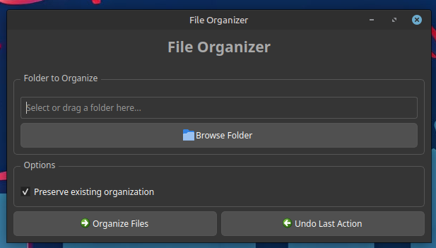
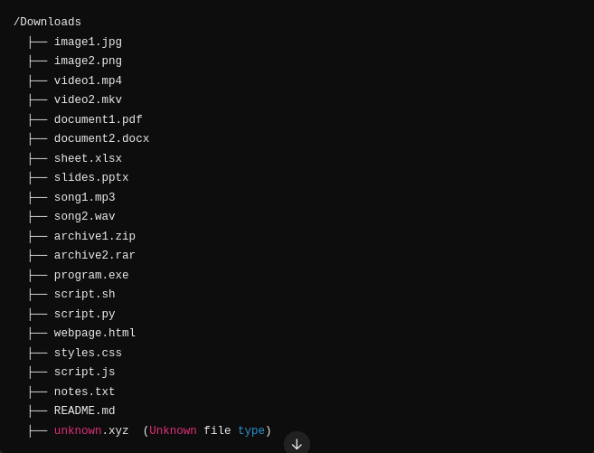
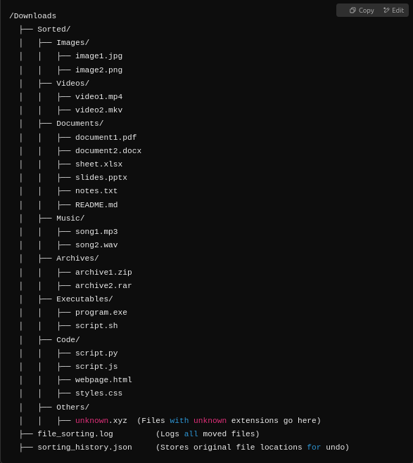

# 📂 File Organizer (with PyQt5 GUI)

A powerful and user-friendly **Python-based file organizer** with a **dark-themed PyQt5 GUI**. This tool helps you automatically sort files in a selected directory into categorized folders such as **Images, Videos, Documents, Music, Archives, Executables, and Code** — with features like **drag-and-drop, undo, and file renaming**.

---

## 🚀 Features

- ✅ Sorts files into categorized folders inside a `Sorted/` directory.
- ✅ Prevents overwriting by automatically renaming duplicate files.
- ✅ **Undo feature**: Reverts last sorting using a saved JSON history.
- ✅ **Drag-and-drop** and folder browsing support.
- ✅ Keeps UI responsive using a progress bar.
- ✅ Fully themed **dark UI** for visual comfort.
- ✅ Logs file movements in `file_sorting.log`.

---

## 📌 Requirements

Ensure Python 3.x is installed.

Install dependencies:
```bash
pip install PyQt5
````

---

## 📁 File Categories

| Category        | Extensions                                                   |
| --------------- | ------------------------------------------------------------ |
| **Images**      | `.jpg`, `.jpeg`, `.png`, `.gif`, `.bmp`, `.svg`, `.webp`     |
| **Videos**      | `.mp4`, `.mkv`, `.flv`, `.avi`, `.mov`, `.wmv`               |
| **Documents**   | `.pdf`, `.docx`, `.doc`, `.txt`, `.xlsx`, `.pptx`, `.csv`    |
| **Music**       | `.mp3`, `.wav`, `.aac`, `.flac`, `.ogg`                      |
| **Archives**    | `.zip`, `.rar`, `.7z`, `.tar`, `.gz`                         |
| **Executables** | `.exe`, `.msi`, `.sh`, `.bat`                                |
| **Code**        | `.py`, `.js`, `.html`, `.css`, `.cpp`, `.java`, `.c`, `.php` |
| **Others**      | Any file not matching above types                            |


# App GUI

# Before use 

# After use 



## 🔄 Undo Functionality

* Each move is saved in `file_organizer_history.json`.
* You can revert sorted files back to their original location using the **Undo Last Action** button.


## 📂 Output Folder Structure

```

YourFolder/
├── Sorted/
│   ├── Images/
│   ├── Documents/
│   ├── Videos/
│   ├── ...
├── file_sorting.log
└── file_organizer_history.json
```

---

## 🛠️ How to Run

```bash
python file_organizer.py
```

---

## 📝 Logging

* All actions are saved in a log file:

  ```
  file_sorting.log
  ```

---


## 📜 License

This project is open-sourced under the **MIT License**.

---

## 👤 Author

**Prince Kumar**
🔗 [GitHub Profile](https://github.com/Prince000101)

